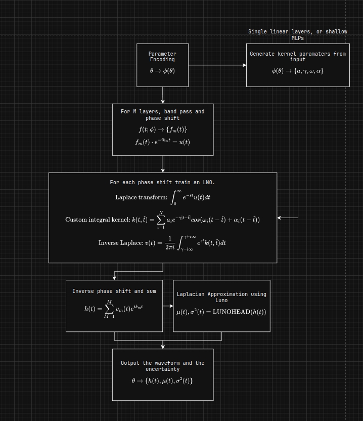

# ARCANIUM

Approximate Relativity Calibration And Neural Uncertainty Modeling (ARCANIUM)
is a machine learning project that tries to understand how to produce long-lasting
gravitational waves. It can also quickly predict what these waves will look like
based on certain input details, faster than traditional mathematical methods.
The system also estimates how confident it is in its predictions, providing a
range that shows how accurate each guess might be.

## Model Architecture

The model works by looking at data at each moment in time. It takes a time
value that has been scaled to fit between –1 and +1, representing the period
around the merger event. Along with this, it uses a set of 15 numbers that
describe characteristics like the masses, spins, orientation, and distance of
the sources, all scaled to a standard range. These two kinds of information are
combined into a single 16-part input. 

This input is then sent to two separate parts of the model. One part, called
“AmplitudeNet,” predicts a single number between 0 and 1 that represents how
strong the wave is at that moment. The other part, called “PhaseDNNFull,”
first processes the 15 source-related numbers through a small network to create
a summary, then combines this with the time information and passes both through
several smaller subnetworks. These subnetworks work together to calculate small
changes in the wave’s phase. By adding up all these small changes over time,
the model builds up a complete picture of the wave’s phase.

When the model is being trained, its predictions for the wave’s strength and
phase are compared to the true known values. The training gives more importance
to getting the details right close to the merger event. Using techniques like
special optimization methods, dropout, normalization, residual connections, and
specific ways of initializing the network, the model learns how to accurately
predict both the size and phase of gravitational wave signals for any set of
source parameters.



## Usage

There are a few files used in this project and they all need to be called from
the projects root directory. First open a python virtual enviroment and install
the requirements.txt file

```python
pip install -r requirements.txt
```

Next to train the model you need to update the config file for your number of
samples to use, then from the root dir run.

```python
python3 -m src.training
```

We can evaluate the model to get the KDE of errors, CDF of absolute errors,
error vs time for one sample, mean absolute error vs time, a heatmap of absolute
errors and summary statistics of the model.

```python
python3 -m src.evaluate
```

We can compare the trained model against PyCBC for generating waveforms using the
benchmark file. By setting the number of samples you compare against it plots
the generation time of each method and the accuracy (MAE) vs model time per waveform.

```python
python3 -m src.benchmark
```

Finally, we can optimise the model using optuna and hyperparameter tuning over
learning rate, dropout, hidden layers, etc.

```python
python3 -m src.hyperparameter_tuning
```

## Issues

If you have any bugs or issues open a pull request and a moderator will take a 
look.
