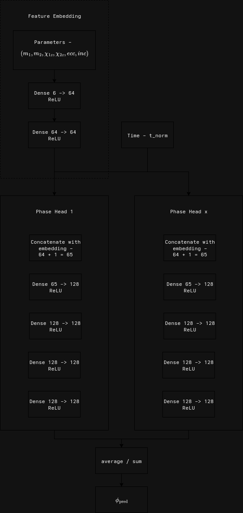

# ARCANIUM

Approximate Relativity Calibration And Neural Uncertainty Modeling (ARCANIUM)
is a machine learning project that tries to understand how to produce long-lasting
gravitational waves. It can also quickly predict what these waves will look like
based on certain input details, faster than traditional mathematical methods.
The system also estimates how confident it is in its predictions, providing a
range that shows how accurate each guess might be.

## Model Architecture

The Phase network first embeds the six physical parameters
(masses, spins, inclination, eccentricity) into a learned representation using
two fully connected layers, then concatenates that embedding with the scalar
time input and passes the result through four deeper layers to predict the
instantaneous phase at each moment. The AmplitudeNet simply takes the normalized
time together with the same six parameter embeddings, feeds them through three
fully connected layers, and outputs the normalized amplitude envelope.
Both networks use ReLU activations and are trained simultaneously with
a combined mean‐squared‐error loss on amplitude and phase, allowing the
optimizer to adjust both models.




## Usage

There are a few files used in this project and they all need to be called from
the projects root directory. First open a python virtual enviroment and install
the requirements.txt file

```python
pip install -r requirements.txt
```

Next to train the model you need to update the config file for your number of
samples to use, then from the root dir run.

```python
python3 -m src.training
```

We can evaluate the model to get the KDE of errors, CDF of absolute errors,
error vs time for one sample, mean absolute error vs time, a heatmap of absolute
errors and summary statistics of the model.

```python
python3 -m src.evaluate
```

We can compare the trained model against PyCBC for generating waveforms using the
benchmark file. By setting the number of samples you compare against it plots
the generation time of each method and the accuracy (MAE) vs model time per waveform.

```python
python3 -m src.benchmark
```

Finally, we can optimise the model using optuna and hyperparameter tuning over
learning rate, dropout, hidden layers, etc.

```python
python3 -m src.hyperparameter_tuning
```

## Issues

If you have any bugs or issues open a pull request and a moderator will take a 
look.
